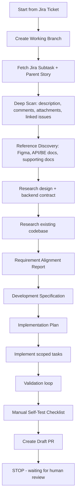

# Mobile AI Production Flow Plugin

A provider-compatible AI workflow plugin for mobile app development. Its goal is to help an AI coding agent execute a consistent flow from a Jira ticket to **Draft Pull Request**.

Compatible with hosts that support plugins/skills/hooks/MCP, such as:

- Claude Code
- OpenAI Codex
- GitHub Copilot / VS Code Agent Plugins

## Workflow Boundary (Mandatory)

The automated workflow **must only run until Draft PR**.

After the Draft PR is created, the workflow **must stop**.

The following activities remain human-gated:

- Manual validation
- Moving PR from Draft to Ready for Review
- Assigning reviewers
- Review process
- Approval
- Merge
- Handling PR review feedback (unless explicitly requested by the engineer)

## Workflow Illustration



## Workflow Steps Executed by the Plugin

1. Create a working branch from the currently checked out branch.
2. Fetch Jira subtask and parent story.
3. Perform a deep scan of Jira (description, comments, attachments, linked issues).
4. Discover Figma references, BE TRD, API contracts, and supporting documentation.
5. Research Figma design and backend contract (if accessible).
6. Research the existing codebase.
7. Create the Requirement Alignment Report.
8. Create the Development Specification.
9. Create the Implementation Plan.
10. Implement tasks within the approved scope.
11. Run the validation loop.
12. Generate the Manual Self-Test Checklist.
13. Create Draft Pull Request.
14. Stop.

## Branch Naming Convention

- With Jira ticket: `feature/<jira-id-lowercase>-<summary-slug>`
- Without Jira ticket (POC/experiment): `experimental/<summary-slug>`

Examples:

- `feature/gz-1234-implementation-feature-flag`
- `experimental/poc-implementation-live-sale`

## Main Prompt Example

```text
Run mobile production workflow for Jira ticket VOILA-123 until Draft PR.

Context:
- Assignee: Muhammad Syamsul Arif
- Platform: Flutter
- Target branch: develop
- PR must be created as Draft
- Stop after Draft PR is created
- Do not mark PR as ready
- Do not merge
- Do not handle review feedback automatically
```

## Review Feedback Prompt Example

```text
Handle PR review feedback for PR #456.

Rules:
- Read all reviewer comments.
- Classify feedback.
- Create fix plan first.
- Wait for my approval before implementation.
- Address only reviewer feedback.
- Re-run validation after fixes.
- Keep PR as draft unless I explicitly say otherwise.
```

## MCP Setup

The bundled `.mcp.json` includes sample server entries. You still need to install/configure the actual MCP servers and credentials in your own environment.

Typical required MCP/tools:

- Jira
- Git/GitHub/GitLab/Bitbucket PR
- Shell/terminal
- Filesystem
- Figma (optional, recommended)
- Docs/Confluence/Google Docs/Notion (optional)
- GraphQL/OpenAPI contract reader (optional)
- CI (optional)

## Compatibility Notes

This plugin uses a multi-manifest structure:

- `plugin.json` for Copilot / VS Code Agent Plugins
- `.claude-plugin/plugin.json` for Claude Code
- `.codex-plugin/plugin.json` for Codex
- Shared: `skills/`, `agents/`, `hooks/`, `.mcp.json`, `scripts/`, `templates/`, `policies/`

## Production Handoff

- Production setup and UAT guide: `INSTALL.md`
- Release readiness check:

```bash
scripts/verify_release_readiness.sh
```
