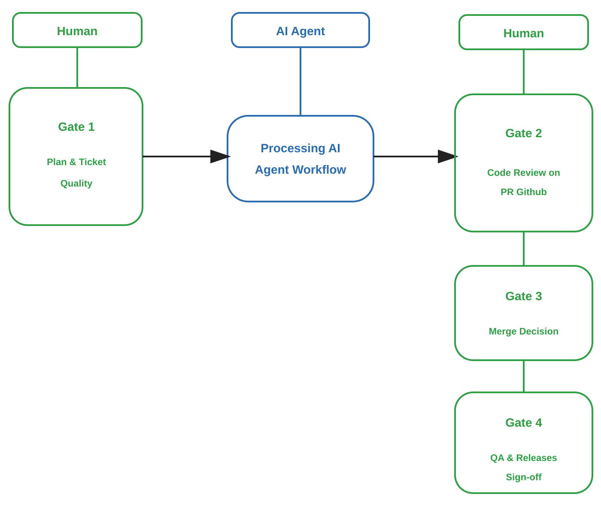

# Mobile AI Production Flow Plugin

A provider-compatible AI workflow plugin for mobile app development. Its goal is to help an AI coding agent execute a consistent flow from a Jira ticket to **Draft Pull Request**.

Compatible with hosts that support plugins/skills/hooks/MCP, such as:

- Claude Code
- OpenAI Codex
- GitHub Copilot / VS Code Agent Plugins

## Workflow Boundary (Mandatory)

The automated workflow **must only run until Draft PR**.

After the Draft PR is created, the workflow **must stop**.

The following activities remain human-gated:

- Manual validation
- Moving PR from Draft to Ready for Review
- Assigning reviewers
- Review process
- Approval
- Merge
- Handling PR review feedback (unless explicitly requested by the engineer)

## Human Gate Model



Gate 1 happens before AI execution. Gates 2-4 are post-Draft-PR human controls.

## Workflow Illustration

```mermaid
flowchart TD
    A[Start from Jira Ticket] --> B[Create Working Branch]
    B --> C[Project Screening]
    C --> D[Ticket Screening]
    D --> E[Fetch Jira Subtask + Parent Story]
    E --> F[Deep Scan: description, comments, attachments, linked issues]
    F --> G[Reference Discovery: Figma, API/BE docs, supporting docs]
    G --> H[Research design + backend contract]
    H --> I[Design Breakdown + YAGNI Gate]
    I --> J[Deep Codebase Understanding (4-Phase)]
    J --> K[Mobile Focused Analysis]
    K --> L[Requirement Alignment Report]
    L --> M[Technical Requirements Document (TRD)]
    M --> N[Planning Options + Human Gate]
    N --> O[Implementation Plan]
    O --> P[Implement scoped tasks]
    P --> Q[Validation loop]
    Q --> R[Manual Self-Test Checklist]
    R --> S[Create Draft PR]
    S --> T[STOP - waiting for human review]
```

## Workflow Steps Executed by the Plugin

1. Create a working branch from the currently checked out branch.
2. Run project-level screening to establish reusable baseline context.
3. Run ticket-level screening with compact JSON output and context budget.
4. Apply token governance checks and compress context when threshold is reached.
5. Fetch Jira subtask and parent story.
6. Perform a deep scan of Jira (description, comments, attachments, linked issues).
7. Discover Figma references, BE TRD, API contracts, and supporting documentation.
8. Research Figma design and backend contract (if accessible).
9. Run design breakdown and apply YAGNI gate.
10. Run deep codebase understanding (4-phase) on the existing codebase.
11. Run mobile-focused analysis (platform, architecture, features, data/networking, security/quality, performance/build).
12. Create the Requirement Alignment Report.
13. Generate the Technical Requirements Document (TRD).
14. Present multiple planning options (simplest first), then wait for human gate decision.
15. Create the Implementation Plan based on selected option.
16. Implement tasks within the approved scope.
17. Run testing mechanism (test inventory, convention compliance, changed-code coverage evidence).
18. Run the validation loop.
19. Generate the Manual Self-Test Checklist.
20. Create Draft Pull Request.
21. Stop.

## Token Efficiency Baseline

- Project screening policy: `policies/project-screening-rules.md`
- Project screening template: `templates/project-screening-template.json`
- Ticket screening policy: `policies/ticket-screening-rules.md`
- Ticket screening template: `templates/ticket-screening-template.json`
- Design breakdown policy: `policies/design-breakdown-rules.md`
- Design breakdown template: `templates/design-breakdown-template.md`
- Deep codebase understanding policy: `policies/deep-codebase-understanding-rules.md`
- Deep codebase understanding template: `templates/deep-codebase-understanding-template.md`
- Mobile-focused analysis policy: `policies/mobile-focused-analysis-rules.md`
- Mobile-focused analysis template: `templates/mobile-focused-analysis-template.md`
- TRD generation policy: `policies/technical-requirements-generation-rules.md`
- TRD template: `templates/technical-requirements-template.md`
- Planning options policy: `policies/planning-options-rules.md`
- Planning options template: `templates/planning-options-template.md`
- Testing implementation policy: `policies/testing-implementation-rules.md`
- Testing plan template: `templates/testing-plan-template.md`
- Token governance policy: `policies/token-governance-rules.md`
- Context compression template: `templates/context-compression-template.md`
- Purpose: keep context portable and compact across Claude, Copilot, and Codex adapters.

## Branch Naming Convention

- With Jira ticket: `feature/<jira-id-lowercase>-<summary-slug>`
- Without Jira ticket (POC/experiment): `experimental/<summary-slug>`

Examples:

- `feature/gz-1234-implementation-feature-flag`
- `experimental/poc-implementation-live-sale`

## Main Prompt Example

```text
Run mobile production workflow for Jira ticket VOILA-123 until Draft PR.

Context:
- Assignee: Muhammad Syamsul Arif
- Platform: Flutter
- Target branch: develop
- PR must be created as Draft
- Stop after Draft PR is created
- Do not mark PR as ready
- Do not merge
- Do not handle review feedback automatically
```

## Review Feedback Prompt Example

```text
Handle PR review feedback for PR #456.

Rules:
- Read all reviewer comments.
- Classify feedback.
- Create fix plan first.
- Wait for my approval before implementation.
- Address only reviewer feedback.
- Re-run validation after fixes.
- Keep PR as draft unless I explicitly say otherwise.
```

## MCP Setup

The bundled `.mcp.json` includes sample server entries. You still need to install/configure the actual MCP servers and credentials in your own environment.

Typical required MCP/tools:

- Jira
- Git/GitHub/GitLab/Bitbucket PR
- Shell/terminal
- Filesystem
- Figma (optional, recommended)
- Docs/Confluence/Google Docs/Notion (optional)
- GraphQL/OpenAPI contract reader (optional)
- CI (optional)

## Compatibility Notes

This plugin uses a multi-manifest structure:

- `plugin.json` for Copilot / VS Code Agent Plugins
- `.claude-plugin/plugin.json` for Claude Code
- `.codex-plugin/plugin.json` for Codex
- Shared: `skills/`, `agents/`, `hooks/`, `.mcp.json`, `scripts/`, `templates/`, `policies/`

## Production Handoff

- Production setup and UAT guide: `INSTALL.md`
- Release readiness check:

```bash
scripts/verify_release_readiness.sh
```
